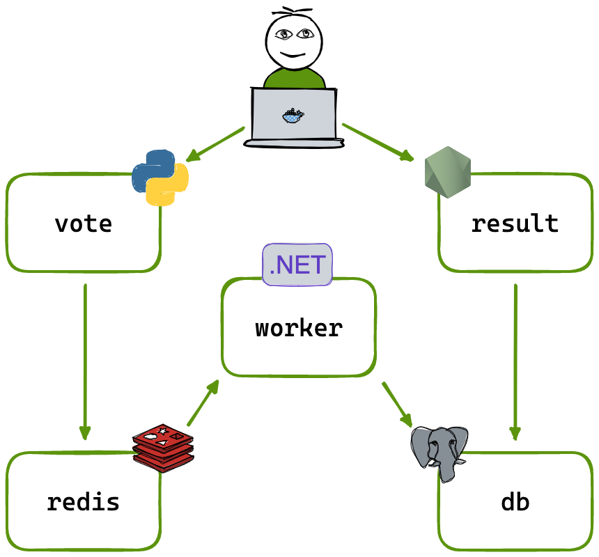

# Ejercicio-3 Configura un Pipeline y desplegarlo en k8s

¡Bienvenido al desafío final del bootcamp DevOps! En este desafío, demostrarás tus habilidades integrando un robusto pipeline de CI/CD utilizando Jenkins y desplegando una aplicación completa en un clúster local de Kubernetes (Minikube). La aplicación comprende varios componentes esenciales:
- Una aplicación web front-end en Python,
- Un backend .NET,
- Un servidor Redis para votos,
- Una base de datos PostgreSQL respaldada por un volumen Docker,
- y Una aplicación web Node.js que muestra los resultados de la votación en tiempo real.

Diagrama de la aplicación **Voting-App**



Este repositorio contiene los archivos y comandos necesarios para desplegar una aplicación a través de un pipeline de CI/CD que automatice la construcción, las pruebas y el despliegue de la aplicación en un entorno local de Kubernetes (Minikube).

## Arquitectura planteada


## Arquitectura implementada
### Diagrama de Componentes:
- GitHub
- Jenkins
- Docker Hub
- Argo CD
- Kubernetes (Minikube)
- Gmail


Flujo: Una vez realizado un cambio en el código fuente por el desarrollador, este es notificado a Jenkins para la ejecución del Pipeline. Una vez realizada la construcción de los artefactos y publicación en Docker Hub, se modifican de los manifiestos de Kubernetes los cuales son monitoreados por Argo CD como herramienta de GitOps y al detectar el cambio de etiquetado de las imágenes Docker realiza el despliegue en Kubernetes (Minikube). Finalmente notifica por correo electrónico el resultado de la ejecución.

## Pasos del Desafío

1. Configuración del Repositorio
- Utiliza un sistema de control de versiones (Git) para almacenar el código fuente de la aplicación.
    - [Application Repository](https://github.com/dsantafe/295devops-jenkins-challenge)
    - [DevOps Repository](https://github.com/dsantafe/295devops-jenkins-challenge-gitops)

2. Construcción del Pipeline en Jenkins

- Instala Jenkins en tu entorno local o en una máquina virtual. 
    - [Configuración Jenkins](/jenkins/README.md)

- Crea un pipeline en Jenkins que abarque las siguientes etapas:
    - Construcción del Front-end en Python
    - Construcción y Despliegue del Backend .NET
    - Construcción del Backend con Node.js
    - Despliegue en Minikube

    

- Pipeline en Jenkins, Stages implementados (jenkinsfile)
1. Login DockerHub. (Debes crear las credenciales en Jenkins usando el token generado desde el repositorio de DockerHub)

    

2. Build & Push Docker Image. (De forma paralela se realiza la construcción del artefacto de cada backend mencionado anteriormente y la publicación en el repositorio de Docker Hub)
3. Checkout from SCM GitOps. (Se clona el repositorio de código que contiene los manifiestos de Kubernetes)
4. Update Deployment Tags. (Se modifican de los manifiestos Deployment el tag versión asociado a la imagen de Docker previamente construida)
5. Push Changed Deployment File. (Se realiza un commit del cambio realizado para actualizar el código fuente, para ello debes crear las credenciales en Jenkins usando el token generado desde el repositorio de GitHub)

    

6. Deploy and Notify. (Se notifica via email el resultado del despliegue del pipeline, para ellos debes configurar las notificaciones desde Jenkins usando el token generado desde Gmail)
---

3. Creación de Objetos de Kubernetes

- Crea archivos YAML separados para cada objeto de Kubernetes que represente los componentes de la aplicación (Deployment, Service, PersistentVolume, etc.).
    - Los manifiestos de Kubernetes tipo Deployment, Service y PersistentVolume se encuentran en el siguiente repositorio [DevOps Repository](https://github.com/dsantafe/295devops-jenkins-challenge-gitops)

4. Creación de Imágenes Docker

- Crea Dockerfiles para cada componente de la aplicación.
    - Dentro de cada proyecto /result, /vote y /worker se encuentra su respectivo Dockerfile con la configuración necesaria.
- Utiliza Jenkins para construir y etiquetar las imágenes Docker.
    - La construcción y etiquetado de las imágenes Docker se realiza en el stage de Jenkins denominado "Build & Push Docker Image".

5. Publicación en Docker Hub usando Jenkins

- Configura Jenkins para autenticarse y publicar las imágenes Docker en un repositorio en Docker Hub.
    - La publicación en Docker Hub se realiza en el stage de Jenkins denominado "Build & Push Docker Image".

6. Notificación y Monitoreo

- Configura notificaciones en el pipeline para informar sobre el éxito o fracaso de cada etapa.
    - La configuración de notificaciones en el pipeline para informar sobre el éxito o fracaso se realiza en el stage de Jenkins denominado "Deploy and Notify".
- Implementa monitoreo básico para la aplicación desplegada en Minikube.

    

7. Documentación

- Proporciona documentación detallada sobre cómo ejecutar el pipeline.
    - Resultado de la ejeción del Pipeline en Jenkins

    

    - Despliegue en Kubernetes (Minikube) con Argo CD

    

    - Ejecución de la aplicación

    ```bash
    $ kubectl port-forward service/vote -n 295devops 5000:80
    $ kubectl port-forward service/result -n 295devops 5001:80
    ```

    

- Incluye información sobre la estructura del pipeline, requisitos previos y configuraciones adicionales.
    - Se deben crear las credenciales mencionadas en Jenkins para los repositorios de Docker Hub, GitHub y Gmail.

    

## Consideraciones Adicionales
- Asegúrate de gestionar las credenciales y secretos de manera segura en Jenkins.
- Utiliza scripts y configuraciones versionadas para la construcción y despliegue.
- Realiza una revisión de seguridad del pipeline.